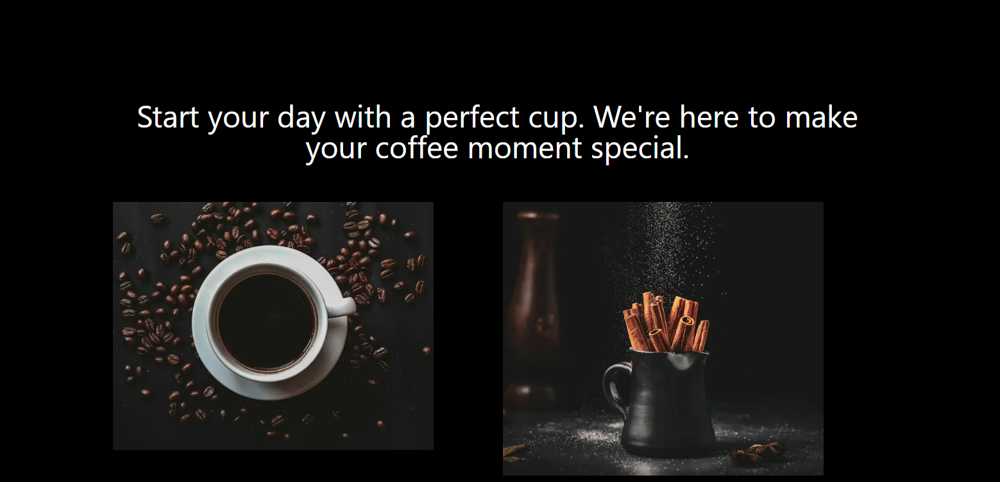

# Description

This project was developed using **Next.js**, a React framework that provides an optimized development experience with features like server-side rendering (SSR) and static site generation (SSG). Next.js makes it easy to create fast and scalable web applications, enhancing performance and user experience. To enrich the visual interaction, I utilized the **ScrollReveal library**, which allows for the implementation of smooth and customizable scroll animations, making navigation more engaging. Additionally, the **inclusion of accordions** in the design provides a modern and intuitive interface, enabling users to **expand and collapse content sections dynamically**. The project was also built with a strong focus on responsive design, ensuring an optimized viewing experience across devices of various sizes. The use of **Tailwind CSS**.

# Main features
- Next.js
- Tailwind CSS
- ScrollReveal
- Responsive Design

# Screenshots

